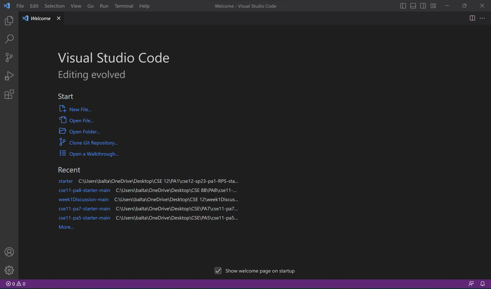
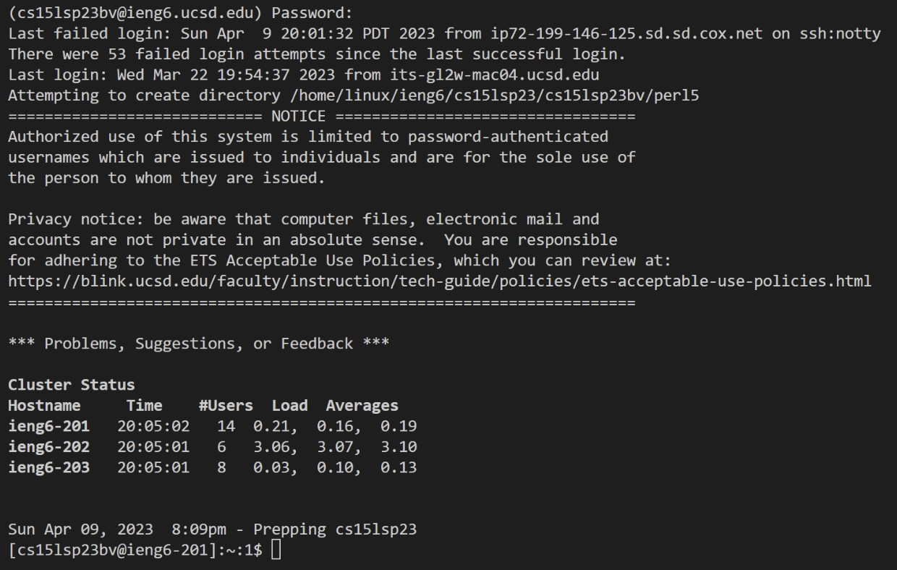
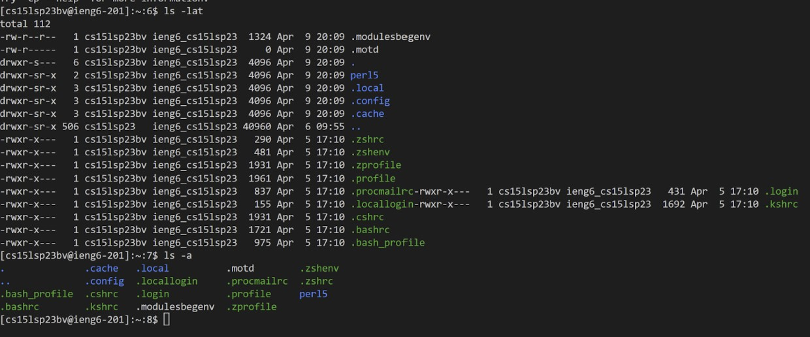

# Lab Report 1
---
Hello! Today we are going to learn about how to log into a course-specific account on `ieng6`.

In order to be able to do this, you need to follow these steps:
## First,
**Installing Visual Studio Code**
---
You need to install Visual Studio Code. 

In order to do it. You have to go to the Visual Studio Code website [Link](https://code.visualstudio.com/)

Follow the instructions to download and install it. 

Make sure that you are installing the correct version for your device! like macOS for Macs and Windows for PCs.

When installed, you should be able to open the application and see the application on your screen.

It should look like this.

## Next,
**Remotely Connecting**
---
Once installed, make sure that you have `git bash` installed in VS Code. If not, get it from here: [Link](https://gitforwindows.org/)

Open a terminal in VS Code and log in using:

`$ ssh cs15lsp23zz@ieng6.ucsd.edu` 

P.S. change `zz` to the letters in your course-specific account.

Follow the instructions on your terminal, say `yes` to the question, then type in your password. If successful, your screen should look like this.

## Lastly,
**Run some commands!**
---
You have successfully logged in! Now try running some commands.

Here are some specific useful commands to try:
* `cd ~`, changes directory to `~`
* `cd`, changes directory to the `home directory`
* `ls -lat`, list the files and folders in the path `-lat`
* `ls -a`, list the files and folders in the path `-a`
* `ls <directory>` where `<directory>` is `/home/linux/ieng6/cs15lsp23abc`, where `abc` is one of the other group members' username., list the file and folder in `<directory>`

Here is an example of running some commands.

The screenshot shows the files and folders in the path `-lat` as `ls - lat` is typed, and shows the files and folders in the path `-a` as `ls -a` is typed.

---
## YOU DID IT!!
You successfully finished the task. In order to log out of the remote server in your terminal, you can use
* Ctrl-D
* Run the command `exit`
