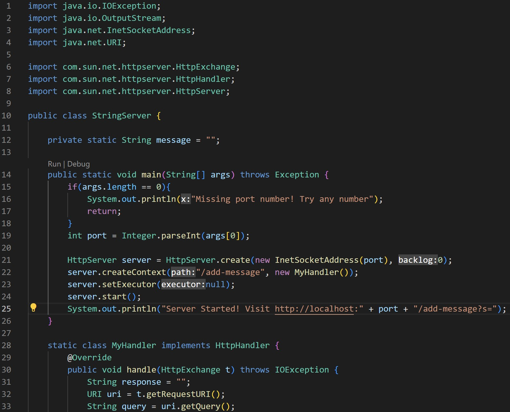
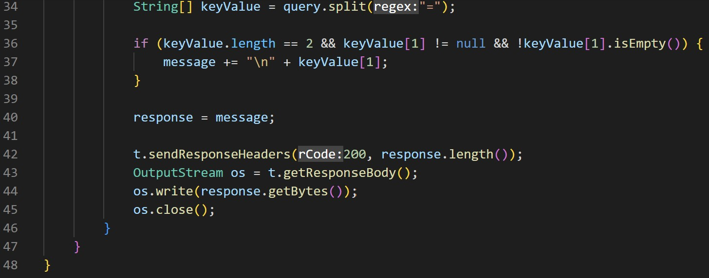
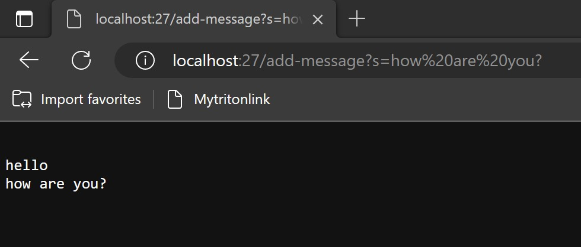

# LAB REPORT 2
---

## Part 1
My code for `StringServer`

The output of my `StringServer`

For this output;

*The method `handle` in the class `MyHandler` is being called.

*The relevant argument to this method is the `t` parameter of type `HttpsExchange`.

*The values of the relevant fields of the class are

  -`HttpExchange t` = `localhost:27/add-message?s=hello`
    -expressed the argument

  -`URI uri` = `add-message?s=hello`
    -took the path from `localhost:27/add-message?s=hello`
  
  -`String query` = `s=hello`
    -took the query from `add-message?s=hello`
  
  -`String[] keyValue` = `keyValue[0] = s` , `keyValue[1] = hello`
    -seperated `s` from `hello`
  
  -`message` = `hello`
    -returned `\n + keyValue[1]` 
  
  -`response` = `hello`
    -copied the value of `message` to  `response`
    
---

For this output;

*The method `handle` in the class `MyHandler` is being called.

*The relevant argument to this method is the `t` parameter of type `HttpsExchange`.

*The values of the relevant fields of the class are

  -`HttpExchange t` = `localhost:27/add-message?s=how are you?`
    -expressed the argument
    
  -`URI uri` = `add-message?s=how are you?`
    -took the path from `localhost:27/add-message?s=how are you?`
  
  -`String query` = `s=how are you?`
    -took the query from `add-message?s=how are you?`
  
  -`String[] keyValue` = `keyValue[0] = s` , `keyValue[1] = how are you?`
    -seperated `s` from `how are you?`
  
  -`message` = `hello \nhow are you?`
    -added `\n + keyValue[1]` to the previous value of `message`, which is
    `hello`
  
  -`response` = `hello \nhow are you?`
    -copied the value of `message` to  `response`

