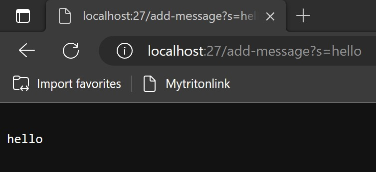
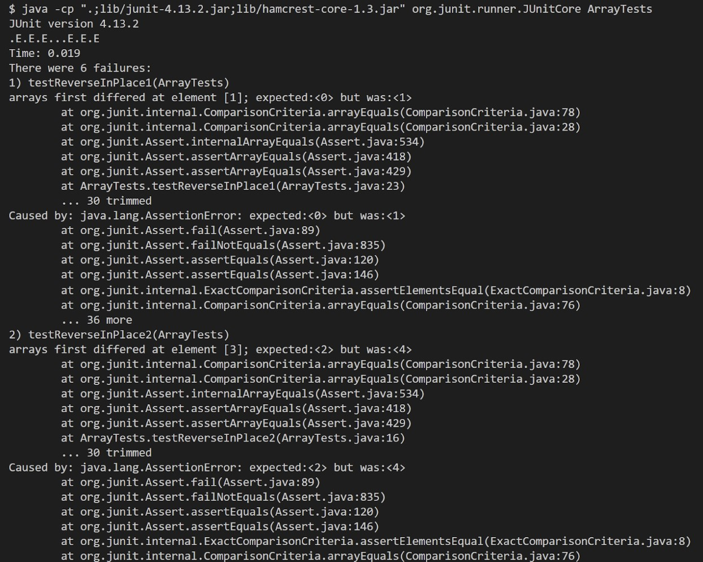

# LAB REPORT 2
---

## PART 1
My code for `StringServer`


--- 

The outputs of my `StringServer`



For this output;

*The method `handle` in the class `MyHandler` is being called.

*The relevant argument to this method is the `t` parameter of type `HttpsExchange`.

*The values of the relevant fields of the class are

  -`HttpExchange t` = `localhost:27/add-message?s=hello`
    -expressed the argument

  -`URI uri` = `add-message?s=hello`
    -took the path from `localhost:27/add-message?s=hello`
  
  -`String query` = `s=hello`
    -took the query from `add-message?s=hello`
  
  -`String[] keyValue` = `keyValue[0] = s` , `keyValue[1] = hello`
    -seperated `s` from `hello`
  
  -`message` = `hello`
    -returned `\n + keyValue[1]` 
  
  -`response` = `hello`
    -copied the value of `message` to  `response`
    
---


For this output;

*The method `handle` in the class `MyHandler` is being called.

*The relevant argument to this method is the `t` parameter of type `HttpsExchange`.

*The values of the relevant fields of the class are

  -`HttpExchange t` = `localhost:27/add-message?s=how are you?`
    -expressed the argument
    
  -`URI uri` = `add-message?s=how are you?`
    -took the path from `localhost:27/add-message?s=how are you?`
  
  -`String query` = `s=how are you?`
    -took the query from `add-message?s=how are you?`
  
  -`String[] keyValue` = `keyValue[0] = s` , `keyValue[1] = how are you?`
    -seperated `s` from `how are you?`
  
  -`message` = `hello \nhow are you?`
    -added `\n + keyValue[1]` to the previous value of `message`, which is
    `hello`
  
  -`response` = `hello \nhow are you?`
    -copied the value of `message` to  `response`

---

## PART 2

A bug that I'm choosing from lab 3 is from the method `reverseInPlace()`.

---

A failure inducing input in `reverseInPlace()` is an array `int[] arr` that has more than one element.

Example 1:

```
  int[] input1 = { 0, 1 };
```

Example 2:

```
  int[] input2 = {10, 20, 30, 40, 50};
```

---

An input that doesn't induce a failure is an array `int[] arr` that only has one or no element.

Example 1:

```
  int[] input3 = { 0 };
```

Example 2:

```
  int[] input4 = { };
```

---

The symptom of this method is:


---

The bug of this code if:

BEFORE

```
static void reverseInPlace(int[] arr) {
    for(int i = 0; i < arr.length; i += 1) {
      int var = arr[i];
      arr[i] = arr[arr.length - i - 1];
    }
  }
```

AFTER
```
static void reverseInPlace(int[] arr) {
    for(int i = 0; i < arr.length / 2; i += 1) { //change `arr.length` to `arr.length / 2`
      int var = arr[i];
      arr[i] = arr[arr.length - i - 1];
      arr[arr.length - i - 1] = var; //new line added
    }
  }
```
The problem is that `BEFORE` runs the for() loop for the entire array, which will re-reverse the elements in the array as it passes the second half of the array.
The changed implemented in `AFTER` will make the code run correctly. By only running the for() loop by `arr.length / 2` times, it will only run for the half section of the array, avoiding it to re-reverse. The added line `arr[arr.length - i - 1] = var;` is for swapping the current element at index `i` with the corresponding element at the oppsite end of the array, which is `arr[arr.length - i - 1`).

---

## PART 3

During Week 2 and Week 3, I've learned many concepts about Web Servers, and Debugging. I've learned new methods for URI's. I've also found out that making basic web servers is not as bad as it seems. It is possible with only knowing basic java language. I also learned the importance of debugging. It is really important to try to be as cautious as someone can in checking their code as there are bugs and failure-inducing input that can cause codes to not run and cause errors.
