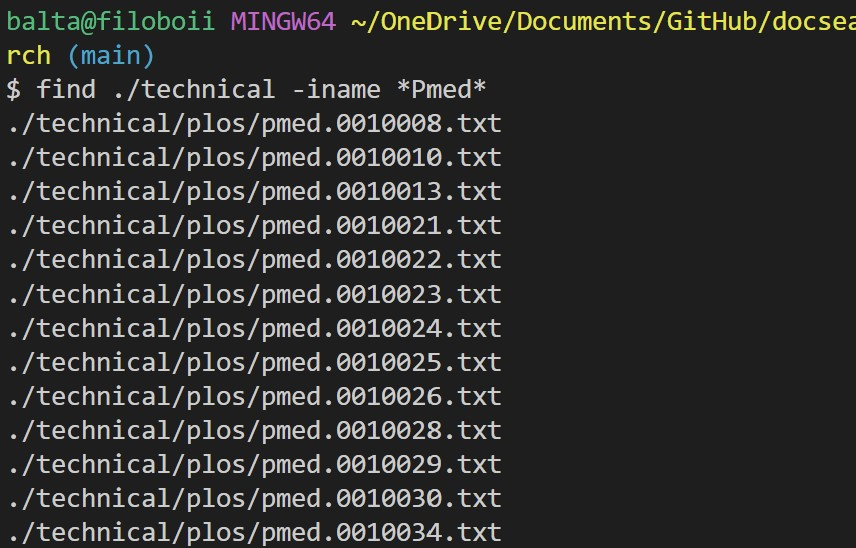
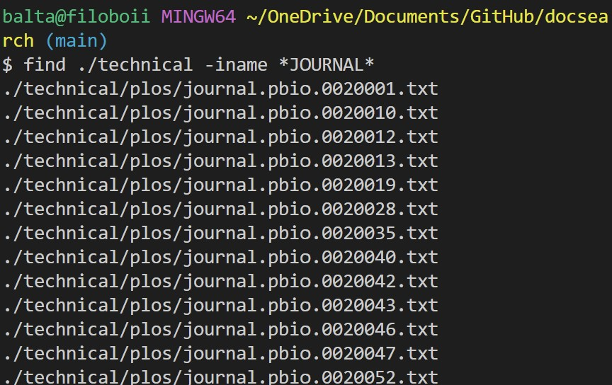
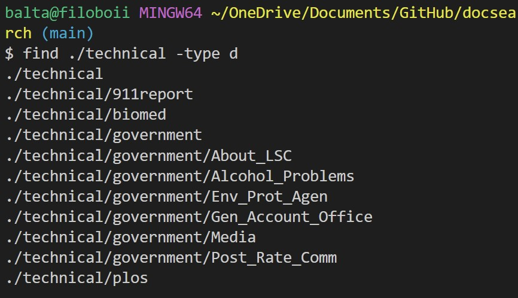
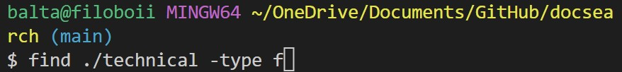
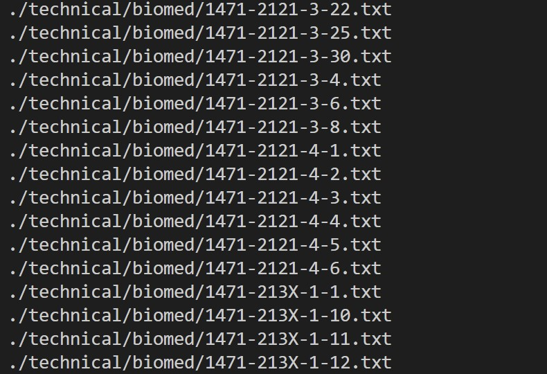
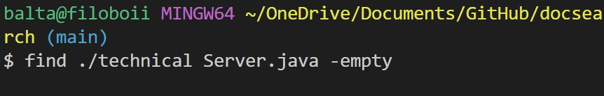
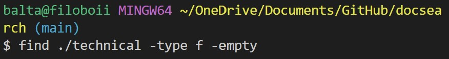

# Lab Report 3
## **Find** Command-line Options

---

1. `find / -name "file.name"`

   This command helps in finding where a file is located.

  **Ex 1.**
  

   This example shows how I was able to find the location of `pmed.0020278.txt`.
  
  **Ex 2.**
    

   
   This examples shows how I was able to find the location of `biomed`.
  
---

2. `find / -iname "*file*name"`

   This command helps in finding files by its approximate name inside the directory you chose. This is useful if a user is not sure whether how they capitalized the letters of their file.

 **Ex 1.**

   This example shows that though I typed `*Pmed*` as my file name input, it showed every file that contains `pmed` in its file name.

 **Ex 2.**

   Just like example 1, though I typed `*JOURNAL*` as my file name input, it showed every file that contains `journal` in its file name. 

---

3. `find / -type *type*`

   This command helps display a sort of any type inside a directory. This is useful if a user wants to see the elements inside their directory.

 **Ex. 1**

   This example shows that by using the letter `d` which stands for directory, it displays every possible directory inside `.\technical`.

 **Ex .2**

   This example shows that by using the letter `f` which stands for files, it displays every file inside `.\technical`.

---

4. `find / -empty`
   This command displays if a file is empty, or displays all the empty files inside a directory.
  
 **Ex 1.**

   This example shows every empty file in `./technical`. Since every file has something in it, the output is nothing.
  
 **Ex 2.**
 
 
 
   This example shows if Server.java is empty. Since it is not empty, the output is nothing.
