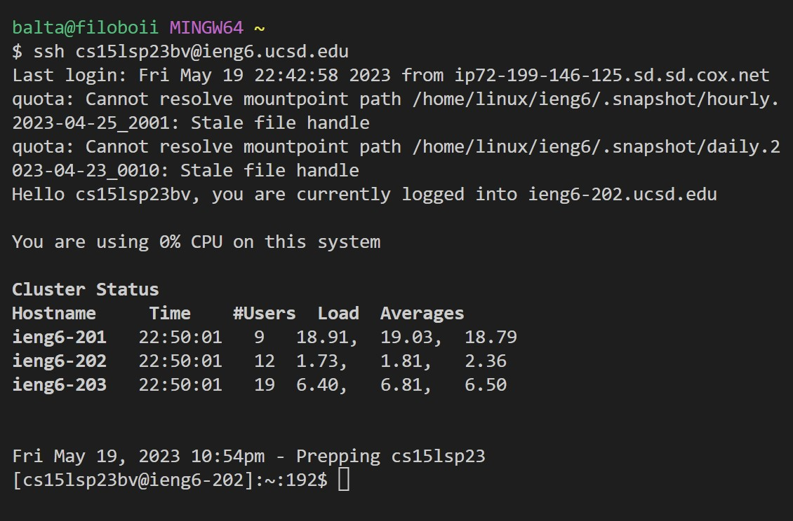

# Lab Report 4

---

## Step 4 (Log into ieng6)

Keys pressed:

Terminal *ssh cs15lsp23bv@ieng6.ucsd.edu*, <enter>.

I opened a new terminal and logged into my ieng6 account.
  
---
  
## Step 5 (Clone your fork of the repository from you Github account)
