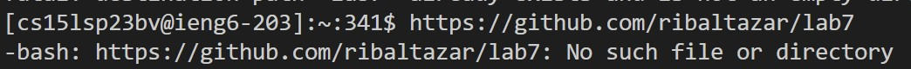

# Lab Report 4

---

## Step 4 (Log into ieng6)

Keys pressed:

*ssh cs15lsp23bv@ieng6.ucsd.edu*, <*enter*>.

I opened a new terminal and logged into my ieng6 account.
  
---
  
## Step 5 (Clone your fork of the repository from your Github account)

Keys pressed:

*git clone https://github.com/ribaltazar/lab7*, <*enter*>.

I cloned the repository by using the command `git clone`. It says that lab7 already exist since I already cloned it beforehand.

---

## Step 6 (Run the tests demonstrating that they fail)

Keys pressed:

*javac -cp .:lib/hamcrest-core-1.3.jar:lib/junit-4.13.2.jar *.java*, <*enter*>, *java -cp .:lib/hamcrest-core-1.3.jar:lib/junit-4.13.2.jar org.junit.runner.JUnitCore ListExamplesTests*, <*enter*>.

I tried compiling and executing the files but it produced an error on `testMerge2`.

---

## Step 7  (Edit the code file to fix the failing test)

Keys pressed:

*vim ListExamples.java* <*enter*>

<*j*>, <*j*>, <*j*>, <*j*>, <*j*>, <*j*>, <*j*>, <*j*>, <*j*>, <*j*>, <*j*>, <*j*>, <*j*>, <*j*>, <*j*>, <*j*>, <*j*>, <*j*>, <*j*>, <*j*>, <*j*>, <*l*>, <*l*>, <*l*>,  <*l*>, <*l*>, <*l*>, <*l*>, <*l*>, <*l*>, <*l*>, <*l*>, <*l*>, <*l*>, <*l*>, <*l*>, <*l*>, <*l*>, <*l*>, <*l*>, <*l*>, <*l*>, <*l*>, <*l*>, <*l*>, <*l*>, <*l*>, <*l*>, <*l*>, <*i*>, 
<*clear*>, <*2*>, <*esc*>

<*:*>, *wq* <*enter*>

I edited ListExamples.java using vim to fix the error. The error was to change `index1` to `index2` in `result.add(list2.get(index2))`.

---

## Step 8 (Run the tests, demonstrating that they now succeed)

Keys pressed:

<*up*>, <*up*>, <*enter*>, *java -cp .:lib/hamcrest-core-1.3.jar:lib/junit-4.13.2.jar org.junit.runner.JUnitCore ListExamplesTests*, <*enter*>

`javac -cp .:lib/hamcrest-core-1.3.jar:lib/junit-4.13.2.jar *.java` command was 3 up in the search history, so I used the up arrow to access it, Then `java -cp .:lib/hamcrest-core-1.3.jar:lib/junit-4.13.2.jar org.junit.runner.JUnitCore ListExamplesTests` was also 2 up in the search history 3 up in the search history and so I also used the up arrow to access it to execute `ListExamplesTests`.

---

## Step 9 (Commit and push the resulting change to your Github account)

Keys pressed:

*git commit -m "commit file"*, <*enter*>, *git remote set-url origin git@github.com:ribaltazar/lab7.git*, <*enter*>, *git remove -v*, <*enter*>, *git push -u origin main*, <*enter*>.

I commit the changes by using the `git commit` command. I changed the url origin to `git@github.com:ribaltazar/lab7.git` so I can push using the SSH link of the repository. I then checked if it succesfully changed by using `git remote -v`. Then I push the changes by using the command `git push -u origin main`.

