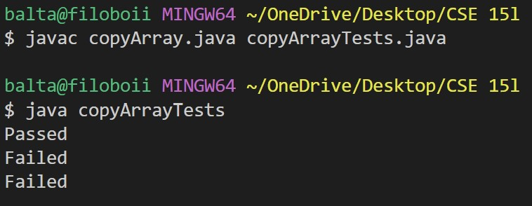
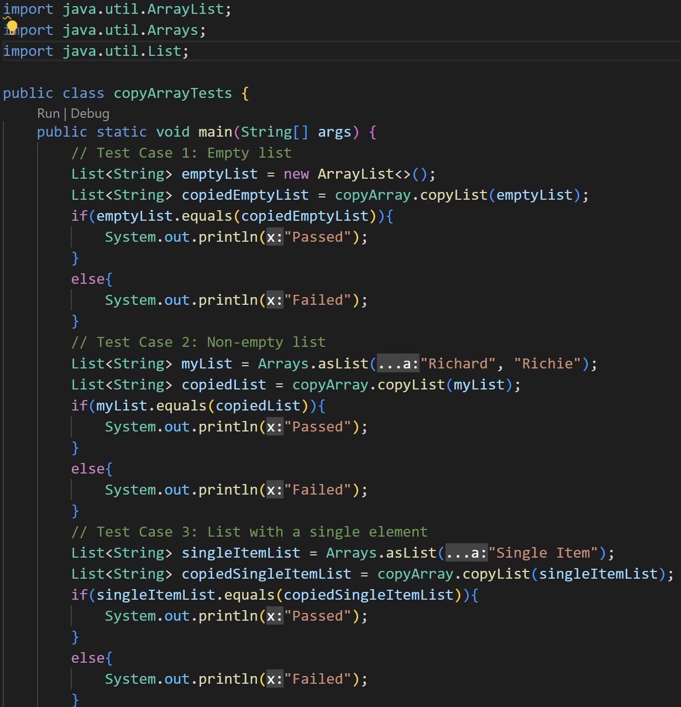
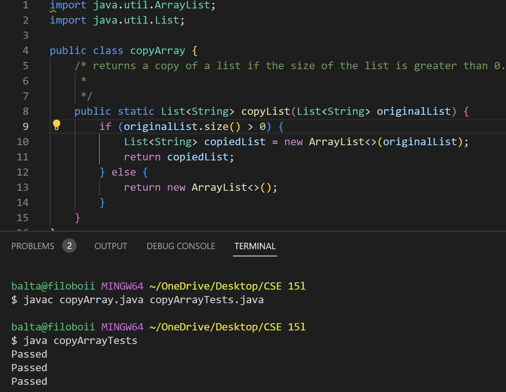

# Lab Report 5

---

## Part 1 - Debugging Scenario

---

## Student Post

*What environment are you using (computer, operating system, web browser, terminal/editor, and so on)?*

- I'm using a laptop

*Detail the symptom you're seeing. Be specific; include both what you're seeing and what you expected to see instead. Screenshots are great, copy-pasted terminal output is also great. Avoid saying “it doesn't work”.*

- I'm trying to run `copyArrayTests` class in order test the testers. 
Instead of getting `Passed` on the all the testers, I'm getting `Failed` 
on two of them

*Detail the failure-inducing input and context. That might mean any or all of the command you're running, a test case, command-line arguments, working directory, even the last few commands you ran. Do your best to provide as much context as you can.*

- I have been compiling them with `javac` and executing with `java`. It runs well, it just
doesn't give me the expected output.

---

## TA response

Hi Student, Thanks for detailing. I see that your testers are coded correctly, but there seem to be a problem in your `copyArray`. Try double checking your if-else statement and make sure your have no typos.

---

## Student response

Thanks!! I double checked and I saw that instead of using `>`, I've used `<`. Now it runs well.

---

## Information
`file/s` - `copyArray`, `copyArrayTest`

`directory` - `CSE15l` folder

`screenshot` - 

`bug` - the student used the sign less than `<` instead of greater than `>`, which causes a major error in his outputs.

`what to edit` - the student needed to edit `line 9` of `copyArray`. Change `<` to 
`>`.

---

## Part 2 - Reflection

---

During the second half of this quarter, I've learned a lot about debugging. It was something I really struggle with before.
But with the techniques and testers we have learned. I got better in it. I also got better in coding in general. Having partners
during labs really helped as I learned new ideas from my partners that I have used in labs and also possibly in my future codings.
